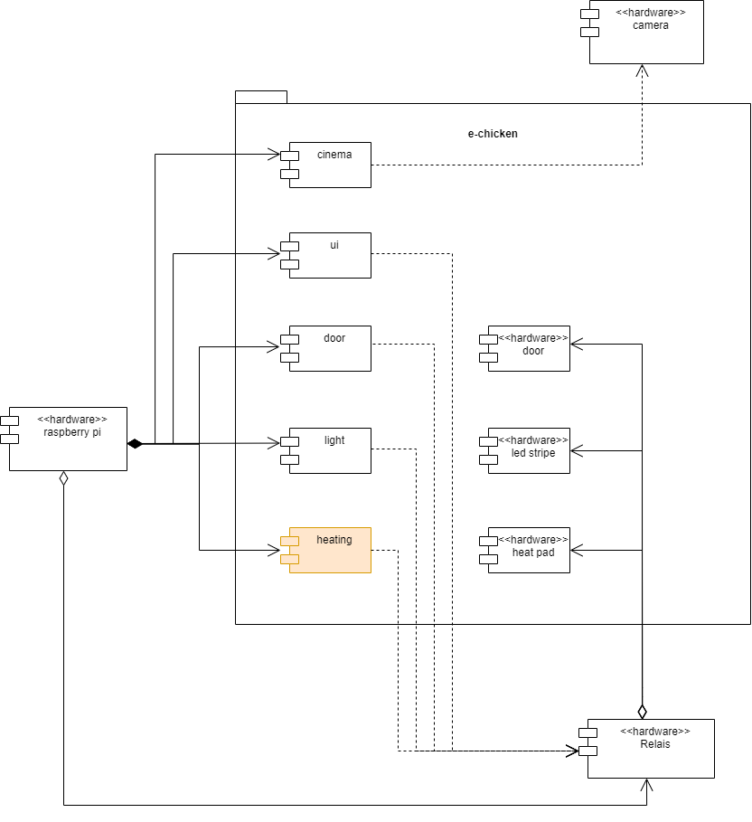

# e-chicken-heating

## Context

The following diagram illustrates the context of this component.

## API

To determine the current temperature, the API provided by brightsky.de is used.
For details visit [https://brightsky.dev](https://brightsky.dev)
